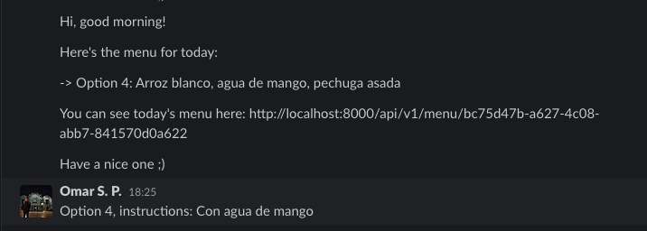

# TheMenuFromNora

[Postman collection](https://documenter.getpostman.com/view/1986978/UyxdMACq)

More documentation in `<host>/api/doc/ `

# Prerequisites

- [Docker](https://docs.docker.com/docker-for-mac/install/)  
- [Slack bot](https://slack.com/intl/es-mx/help/articles/115005265703-C%C3%B3mo-crear-un-bot-para-tu-espacio-de-trabajo)


# Local development
- Create a [Slack bot](https://slack.com/intl/es-mx/help/articles/115005265703-C%C3%B3mo-crear-un-bot-para-tu-espacio-de-trabajo)
named `noras_daily_food_delivery` with the necessary 
scopes to read/write chats, see chanels history and 
to post messages to specific channels in Slack and finally
 add it to your preferred space.
 
 - Run:
 ```
cp .env.sample .env
```
 - Fill the environment variables in the new `.env` file
 ```
SLACK_API_KEY=<Your bot's api key>
SLACK_CHANNEL_ID=<The id of your channel>
HOST=<your localhost url>
DJANGO_SECRET_KEY=
```

 - Start the server:
```bash
docker-compose up
```

- Run the commands below in case there's missing migrations:

```bash
docker-compose run --rm web ./manage.py makemigrations
docker-compose run --rm web ./manage.py migrate

```

- Create a super user (Nora) with:
```
docker-compose run --rm web ./manage.py createsuperuser
```
- Login in `<localhost>/login` with the credentials of the superuser just created
 
- Once the reminder for the menu is sent you have to answer with something like this




